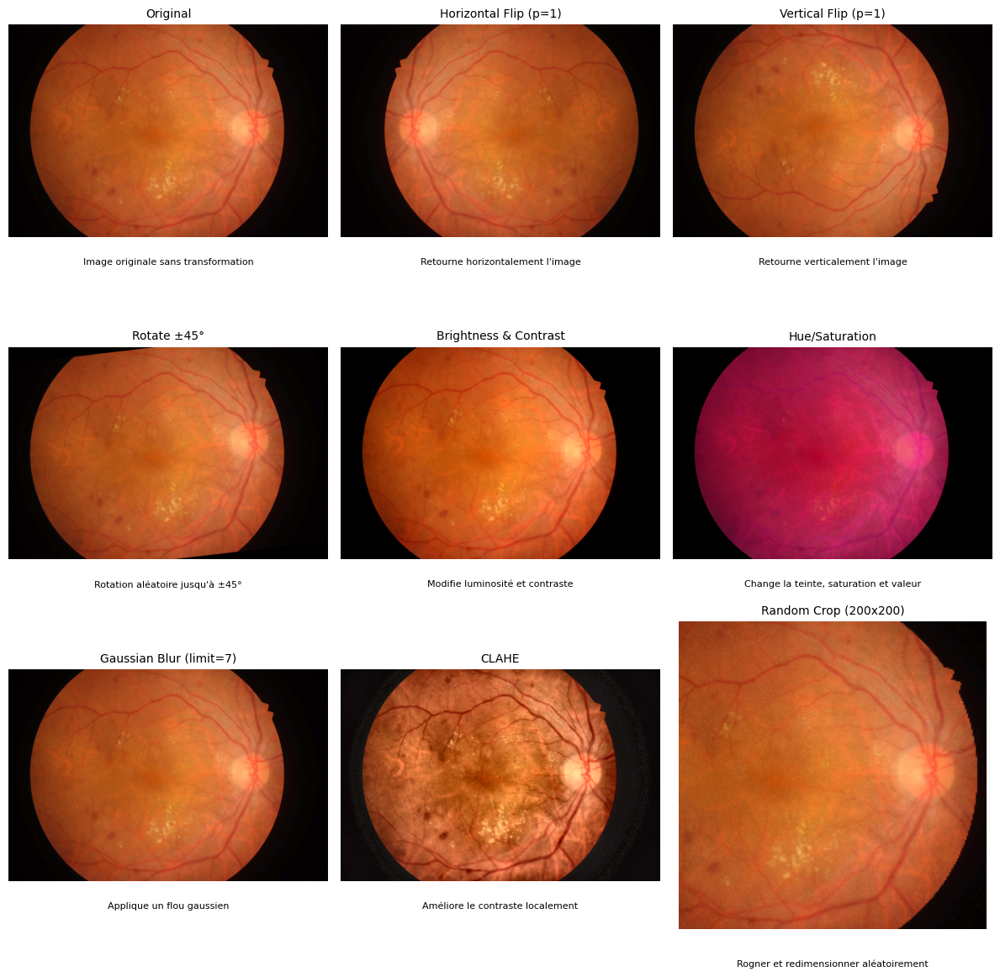

# Visualisation des Data Augmentations

Ce notebook permet de **visualiser en temps réel les effets de différentes data augmentations** sur des images médicales, avant l'entraînement d'un modèle de détection (ex : YOLOv8).

---

## 🎯 Objectif

- Comprendre l'impact de chaque transformation : rotation, flip, luminosité, contraste, teinte, saturation, blur, CLAHE, crop…
- Aider à choisir les paramètres adaptés pour l'imagerie médicale.

---

## 🖼 Exemple visuel

Voici un exemple généré par le notebook sur la même image originale :



> Chaque subplot indique la transformation appliquée et ses paramètres.

---
# Visualisation des Data Augmentations Médicales

Ce dépôt contient un **notebook interactif** pour visualiser les effets des différentes data augmentations sur des images médicales avant entraînement d’un modèle de détection (ex : YOLOv8).  
Il inclut des recommandations selon le type d’image et des exemples concrets.

---

## 🧠 Data Augmentation selon le type d’image

### 1️⃣ IRM / Radiographies
| Augmentation | Effet | Pertinence |
|--------------|-------|------------|
| Rotation ±5° | Inclinaison légère | ✅ Simule variation de position du patient |
| Translation ±10% | Décalage léger | ✅ Corrige le cadrage différent entre scans |
| Scale ±20% | Zoom / réduction | ✅ Simule différentes résolutions |
| Horizontal Flip | Inversion gauche-droite | ⚠️ Seulement si anatomie symétrique |
| Vertical Flip | Inversion haut-bas | ❌ Peu recommandé |
| Brightness / Contrast | Variation luminosité | ✅ Simule différences machine |
| Hue / Saturation | Variation teinte | ⚠️ Peu utile sur images monochromes |
| Gaussian Blur | Flou léger | ✅ Simule bruit acquisition ou artefacts |
| CLAHE | Contraste local | ✅ Particulièrement utile sur radiographies |

### 2️⃣ Images rétiniennes (Fundus, microvaisseaux, lésions)
| Augmentation | Effet | Pertinence |
|--------------|-------|------------|
| Rotation ±15° | Inclinaison légère | ✅ Simule position variable du patient |
| Translation ±5% | Décalage léger | ✅ Cadrage légèrement différent |
| Scale ±10% | Zoom / réduction | ✅ Simule variation de champ |
| Horizontal Flip | Inversion gauche-droite | ✅ Si annotations adaptées |
| Vertical Flip | Inversion haut-bas | ⚠️ À utiliser avec précaution |
| Brightness / Contrast | Variation luminosité | ✅ Simule variation acquisition |
| Hue / Saturation | Variation couleur | ✅ Important pour images couleur fundus |
| Gaussian Blur | Flou léger | ⚠️ Limiter pour ne pas masquer micro-lésions |
| Random Crop | Rogner / zoom sur zone | ✅ Permet focus sur zones d’intérêt |

---

## 🛠 Exemples d’appel de fonction (Albumentations)

```python
import albumentations as A

# Flip horizontal
transform = A.HorizontalFlip(p=1)

# Rotation ±15°
transform = A.Rotate(limit=15, p=1)

# Translation ±10%, Scale ±20%, Shear ±5°
transform = A.Affine(translate_percent={"x":0.1,"y":0.1}, scale=1.2, shear=5, p=1)

# Brightness / Contrast
transform = A.RandomBrightnessContrast(brightness_limit=0.2, contrast_limit=0.2, p=1)

# Hue / Saturation / Value
transform = A.HueSaturationValue(hue_shift_limit=10, sat_shift_limit=20, val_shift_limit=15, p=1)

# Gaussian Blur
transform = A.GaussianBlur(blur_limit=7, p=1)

# CLAHE (Contrast Limited Adaptive Histogram Equalization)
transform = A.CLAHE(clip_limit=4.0, tile_grid_size=(8,8), p=1)

# Random Crop / Resize
transform = A.RandomResizedCrop(height=200, width=200, scale=(0.8,1.0), p=1)

## 🛠 Instructions

1. Installer les dépendances :
```bash
pip install albumentations matplotlib opencv-python ipywidgets
